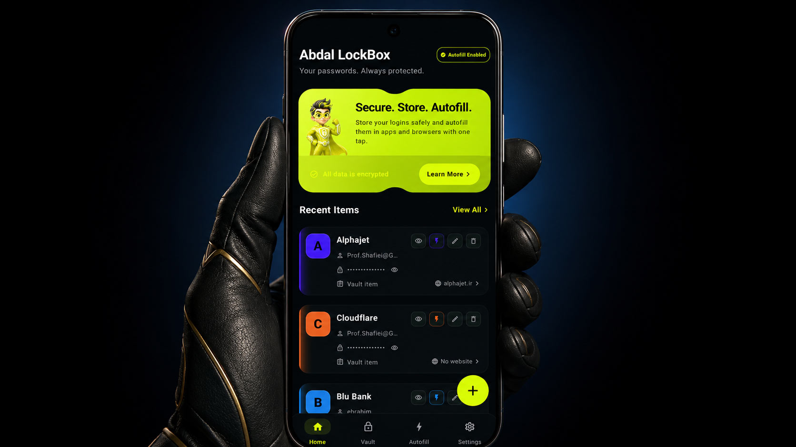

  

# Abdal LockBox

**Abdal LockBox** is a secure offline encrypted vault for Android, designed for storing passwords and sensitive information with a focus on privacy, local-first security, and portable encrypted backups.

This repository provides the public documentation and technical specifications for Abdal LockBox.

## Documentation

* [Whitepaper](docs/WHITEPAPER.md)
* [ABLBX File Format Specification](docs/ABLBX-FORMAT.md)

## ABLBX Encrypted Vault Backup Format

ABLBX is the encrypted vault backup format used by Abdal LockBox for secure export and import of vault data.

* File extension: `.ablbx`
* Media type: `application/vnd.abdalsecuritygroup.lockbox`
* Recommended filename pattern: `abdal-lockbox-backup-{yyyyMMdd-HHmmss}.ablbx`

For the full technical details, see the [ABLBX File Format Specification](docs/ABLBX-FORMAT.md).

## Author

**Ebrahim Shafiei (EbraSha)**
**Abdal Security Group**

* GitHub: https://github.com/ebrasha
* Email: [Prof.Shafiei@Gmail.com](mailto:Prof.Shafiei@Gmail.com)
